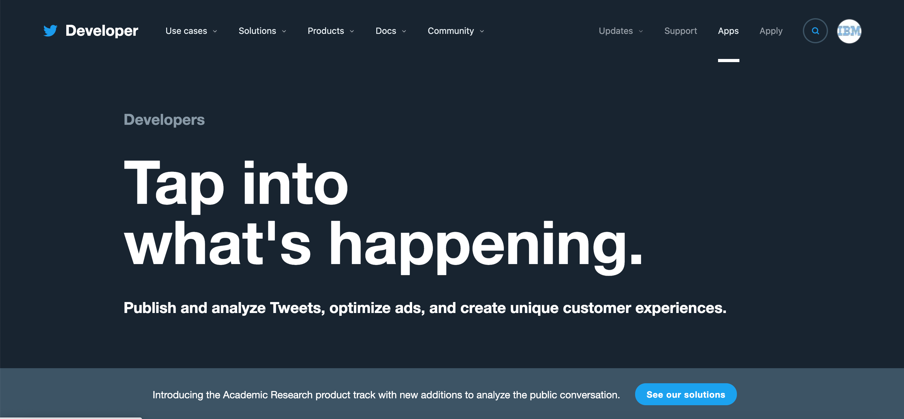
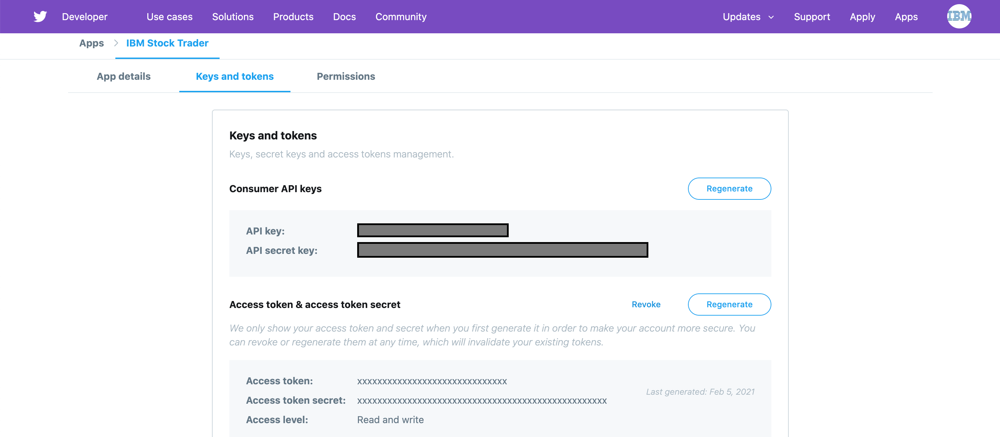

This service sends a tweet via the *@IBMStockTrader* account on **Twitter**.

This service expects a **JSON** object in the http body, containing the following fields: *id*, *owner*, *old*, and *new*.  It returns a **JSON** object containing the message sent (or any error message from the attempt) and the location (**Twitter**).

There is another implementation of this service called *notification-slack*, which posts the message to a **Slack** channel instead.  If both implmentations of the *Notification* service are installed, you could use **Istio** *routing rules* to determine which gets used, and under what conditions.

### Account Setup

IBMStockTrader needs 4 keys from Twitter before messages can be posted to an account. To get those values, log into Twitter and navigate to https://developer.twitter.com/en. Click into the Apps menu on the top right of the webpage.



Apply for a developer account. Once that is complete, create your first app. In the app details menu, navigate to the Keys and tokens tab. Here you will find the 4 keys (Consumer API key & secret key, Access token & token secret) that StockTrader needs to tweet messages.



Assign these values to their respective keys when creating a StockTrader instance.

### Deploy

Use WebSphere Liberty helm chart to deploy Twitter Notification microservice:
```bash
helm repo add ibm-charts https://raw.githubusercontent.com/IBM/charts/master/repo/stable/
helm install ibm-charts/ibm-websphere-liberty -f <VALUES_YAML> -n <RELEASE_NAME> --tls
```

In practice this means you'll run something like:
```bash
helm repo add ibm-charts https://raw.githubusercontent.com/IBM/charts/master/repo/stable/
helm install ibm-charts/ibm-websphere-liberty -f manifests/notification-twitter-values.yaml -n notification-twitter --namespace stock-trader --tls
```
